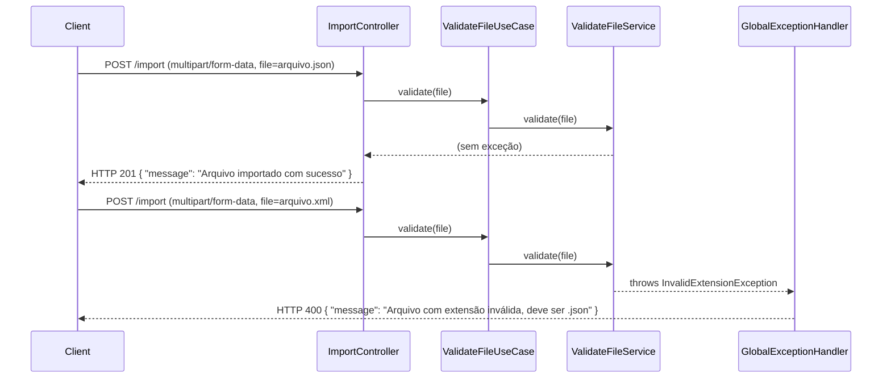

# Design Document — import-endpoint

## Overview

Esta feature implementa o endpoint `POST /import` do sistema MockAI. O objetivo é receber um arquivo binário via `multipart/form-data`, validar se a extensão do arquivo é `.json` (sem distinção de maiúsculas/minúsculas) e retornar uma resposta de sucesso (HTTP 201) ou de erro (HTTP 400) conforme o resultado da validação.

O escopo desta feature é estritamente limitado à recepção e validação da extensão do arquivo. Leitura do conteúdo do arquivo e persistência em banco de dados estão fora do escopo.

A implementação segue rigorosamente os princípios de Clean Architecture e SOLID definidos nas diretrizes do projeto: o domínio não conhece frameworks, a lógica de validação reside no serviço de aplicação, e o controller depende exclusivamente de interfaces.

---

## Architecture

O fluxo de dados segue o modelo de camadas concêntricas da Clean Architecture, com dependências sempre apontando para dentro:

```
HTTP Request
     │
     ▼
┌─────────────────────────────────────────────────────┐
│  adapter/in/web                                     │
│  ImportController  ──────────────────────────────►  │
│  (Spring MVC)       ValidateFileUseCase (interface) │
└─────────────────────────────────────────────────────┘
                              │
                              ▼
              ┌───────────────────────────────┐
              │  application/service          │
              │  ValidateFileService          │
              │  (implements use case)        │
              └───────────────────────────────┘
                              │
                              ▼
              ┌───────────────────────────────┐
              │  domain/exception             │
              │  InvalidExtensionException    │
              │  (pure Java, no frameworks)   │
              └───────────────────────────────┘
```

O tratamento de exceções de domínio é centralizado em um `@ControllerAdvice`, que intercepta `InvalidExtensionException` e a mapeia para HTTP 400 sem expor detalhes internos ao cliente.

### Diagrama de Sequência



---

## Components and Interfaces

### 1. `InvalidExtensionException` — `domain/exception`

Exceção de domínio pura, sem dependências de frameworks. Lançada quando a extensão do arquivo não é `.json`.

```
package: com.ia.para.devs.mockai.domain.exception
class: InvalidExtensionException extends RuntimeException
```

- Não importa nenhum tipo fora do pacote `domain`.
- Contém apenas a mensagem de erro passada no construtor.

---

### 2. `FileData` — `domain/model`

Objeto de domínio que representa o arquivo recebido, identificado pelo nome original. Não contém anotações de framework.

```
package: com.ia.para.devs.mockai.domain.model
class: FileData
fields:
  - String originalFilename
  - byte[] content
```

> **Decisão de design:** `FileData` encapsula os dados do arquivo no domínio, desacoplando o serviço de aplicação do tipo `MultipartFile` do Spring. Isso garante que a lógica de validação seja testável sem dependência de framework.

---

### 3. `ValidateFileUseCase` — `application/port/in`

Interface que define o contrato de entrada para validação de arquivo. O controller depende exclusivamente desta interface.

```
package: com.ia.para.devs.mockai.application.port.in
interface: ValidateFileUseCase
method: void validate(FileData file)
```

- Lança `InvalidExtensionException` quando a extensão é inválida.
- Não retorna valor — a ausência de exceção indica sucesso.

---

### 4. `ValidateFileService` — `application/service`

Implementação do caso de uso. Contém exclusivamente a lógica de validação de extensão.

```
package: com.ia.para.devs.mockai.application.service
class: ValidateFileService implements ValidateFileUseCase
```

**Algoritmo de validação:**
1. Obter o nome original do arquivo (`FileData.originalFilename`).
2. Localizar o último índice do caractere `.` no nome.
3. Se não houver `.`, lançar `InvalidExtensionException`.
4. Extrair a substring após o último `.` (a extensão).
5. Comparar com `"json"` usando `equalsIgnoreCase`.
6. Se diferente, lançar `InvalidExtensionException`.
7. Se igual, retornar normalmente (sem exceção).

---

### 5. `ImportResponse` — `adapter/in/web/dto`

DTO de resposta retornado pelo controller em ambos os cenários (sucesso e erro).

```
package: com.ia.para.devs.mockai.adapter.in.web.dto
record/class: ImportResponse
fields:
  - String message
```

---

### 6. `ImportController` — `adapter/in/web`

Controller REST que expõe o endpoint `POST /import`. Depende exclusivamente da interface `ValidateFileUseCase` via injeção por construtor. Não captura exceções de domínio diretamente.

```
package: com.ia.para.devs.mockai.adapter.in.web
class: ImportController
constructor: ImportController(ValidateFileUseCase validateFileUseCase)
endpoint: POST /import
  - consumes: multipart/form-data
  - param: @RequestPart("file") MultipartFile file
  - returns: ResponseEntity<ImportResponse>
```

**Responsabilidades:**
1. Receber o `MultipartFile` do Spring MVC.
2. Mapear para `FileData` (adaptação do tipo Spring para o tipo de domínio).
3. Delegar para `ValidateFileUseCase.validate(fileData)`.
4. Retornar `ResponseEntity` com HTTP 201 e `ImportResponse("Arquivo importado com sucesso")`.

**Não é responsabilidade do controller:**
- Capturar `InvalidExtensionException` — delegado ao `@ControllerAdvice`.
- Validar a extensão — delegado ao use case.

---

### 7. `GlobalExceptionHandler` — `adapter/in/web/handler`

Componente `@ControllerAdvice` que intercepta exceções de domínio e as mapeia para respostas HTTP sem expor detalhes internos.

```
package: com.ia.para.devs.mockai.adapter.in.web.handler
class: GlobalExceptionHandler (@ControllerAdvice)
method: handleInvalidExtension(InvalidExtensionException ex)
  - returns: ResponseEntity<ImportResponse> com HTTP 400
  - body: ImportResponse("Arquivo com extensão inválida, deve ser .json")
```

**Garantias:**
- A resposta não expõe stack trace, nome de classe ou mensagem bruta da exceção.
- A mensagem retornada é sempre a string literal definida no requisito.

---

## Data Models

### `FileData` (domínio)

| Campo | Tipo | Descrição |
|---|---|---|
| `originalFilename` | `String` | Nome original do arquivo enviado pelo cliente |
| `content` | `byte[]` | Conteúdo binário do arquivo (não utilizado nesta feature) |

### `ImportResponse` (DTO de resposta)

| Campo | Tipo | Descrição |
|---|---|---|
| `message` | `String` | Mensagem de resultado da operação |

### Mapeamento `MultipartFile` → `FileData`

O controller é responsável por converter o `MultipartFile` recebido do Spring MVC em um `FileData` de domínio:

```java
FileData fileData = new FileData(
    file.getOriginalFilename(),
    file.getBytes()
);
```

Esta conversão ocorre no adapter (controller), mantendo o domínio e o serviço de aplicação livres de dependências do Spring.

---

## Correctness Properties

*Uma propriedade é uma característica ou comportamento que deve ser verdadeiro em todas as execuções válidas de um sistema — essencialmente, uma declaração formal sobre o que o sistema deve fazer. Propriedades servem como ponte entre especificações legíveis por humanos e garantias de corretude verificáveis por máquina.*

A lógica de validação de extensão em `ValidateFileService` é uma função pura: recebe um nome de arquivo e ou retorna normalmente ou lança uma exceção. O espaço de entradas é grande (qualquer string), o comportamento varia significativamente com a entrada, e 100 iterações revelarão casos de borda que exemplos fixos não cobrem (casings incomuns, nomes com múltiplos pontos, nomes com apenas extensão, etc.). Property-based testing é adequado aqui.

A biblioteca escolhida é **jqwik** (versão `1.9.3`), que integra nativamente com JUnit 5 (já utilizado no projeto) e é a escolha padrão para PBT em Java moderno.

---

### Property 1: Validação bem-sucedida para qualquer nome com extensão `.json` (case-insensitive)

*Para qualquer* nome de arquivo cuja extensão (substring após o último `.`) seja `json` em qualquer combinação de maiúsculas e minúsculas (ex.: `.json`, `.JSON`, `.Json`, `.jSoN`), a chamada a `ValidateFileService.validate()` **não deve lançar nenhuma exceção**.

**Validates: Requirements 2.1, 2.4**

---

### Property 2: Exceção lançada para qualquer nome com extensão diferente de `.json` ou sem extensão

*Para qualquer* nome de arquivo cuja extensão não seja `json` (em qualquer casing) — incluindo nomes sem nenhum caractere `.` — a chamada a `ValidateFileService.validate()` **deve lançar `InvalidExtensionException`**.

**Validates: Requirements 2.2, 2.3**

---

## Error Handling

| Cenário | Componente responsável | Resposta HTTP | Corpo |
|---|---|---|---|
| Campo `file` ausente na requisição | Spring MVC (resolução automática de `@RequestPart`) | 400 | Mensagem de erro do Spring (campo obrigatório ausente) |
| Extensão do arquivo inválida | `GlobalExceptionHandler` via `@ControllerAdvice` | 400 | `{ "message": "Arquivo com extensão inválida, deve ser .json" }` |
| Extensão `.json` válida | `ImportController` | 201 | `{ "message": "Arquivo importado com sucesso" }` |

**Princípios de tratamento de erros:**
- O `ImportController` **não captura** nenhuma exceção. Todo tratamento é delegado ao `GlobalExceptionHandler`.
- O `GlobalExceptionHandler` **nunca** expõe stack trace, nome de classe Java ou mensagem bruta da exceção ao cliente.
- A mensagem de erro retornada ao cliente é sempre uma string literal controlada, definida no handler.
- `InvalidExtensionException` é uma exceção de domínio pura — não estende nenhuma classe de framework.

