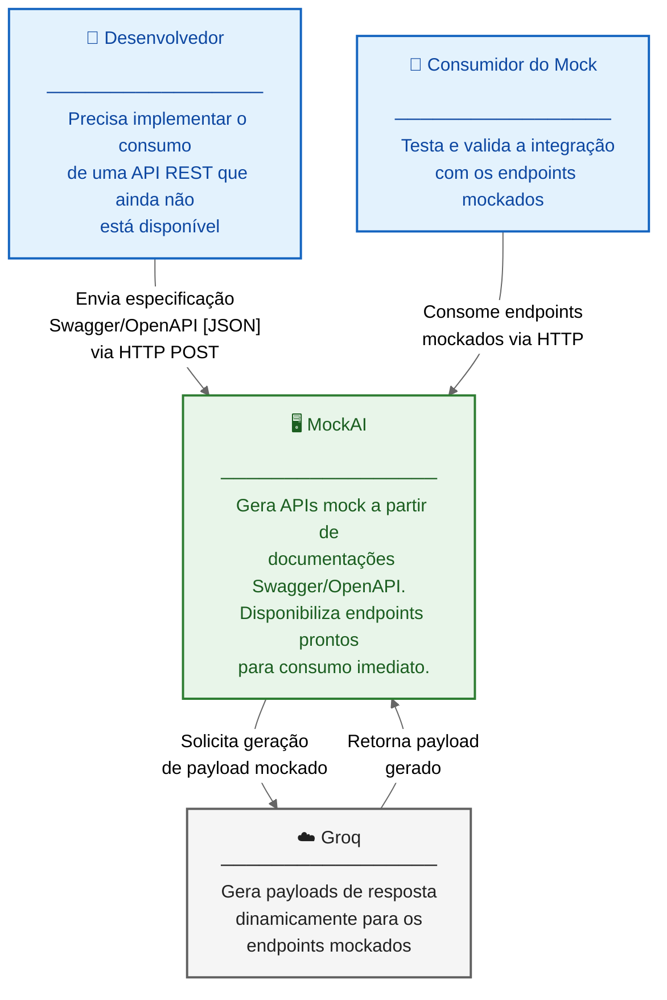
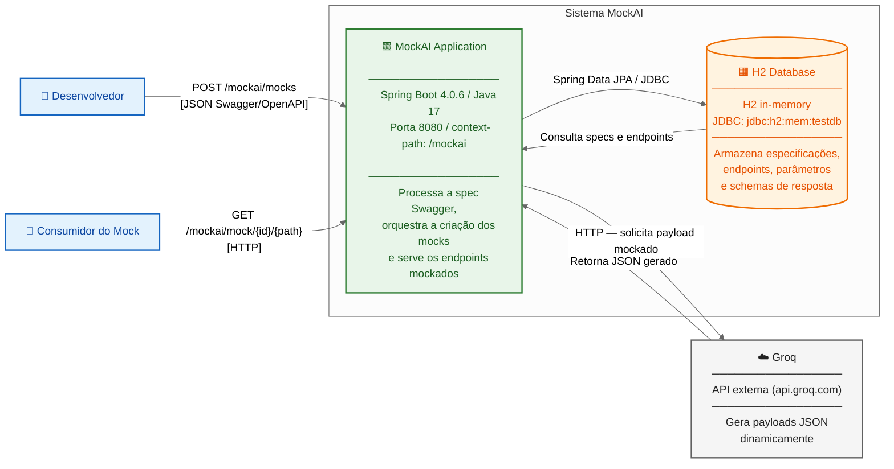
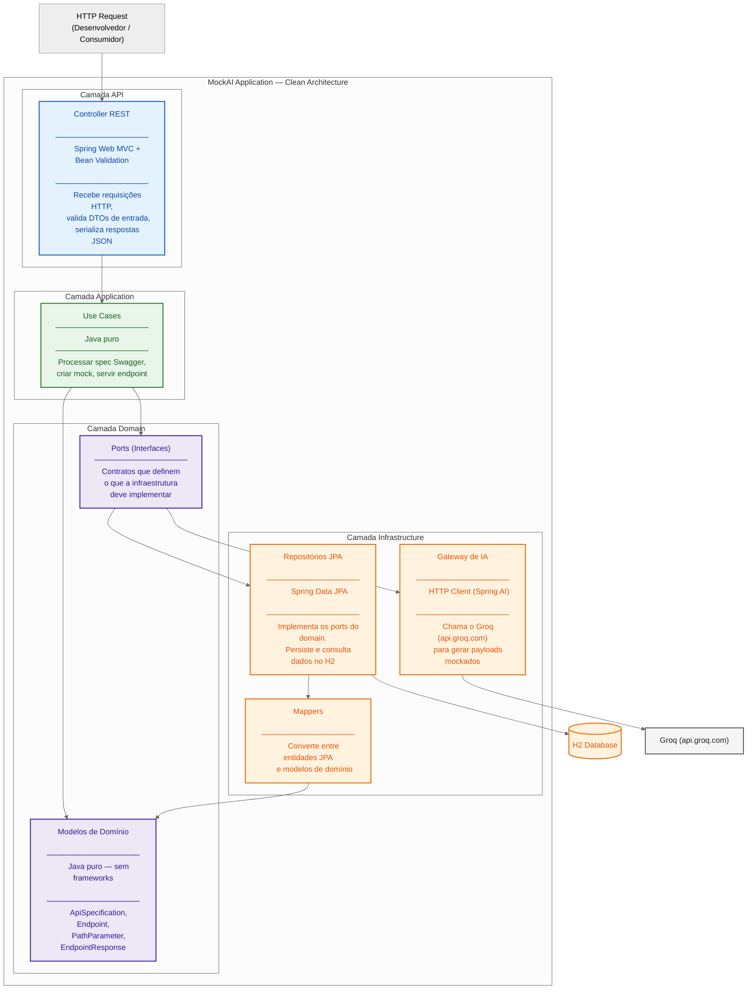
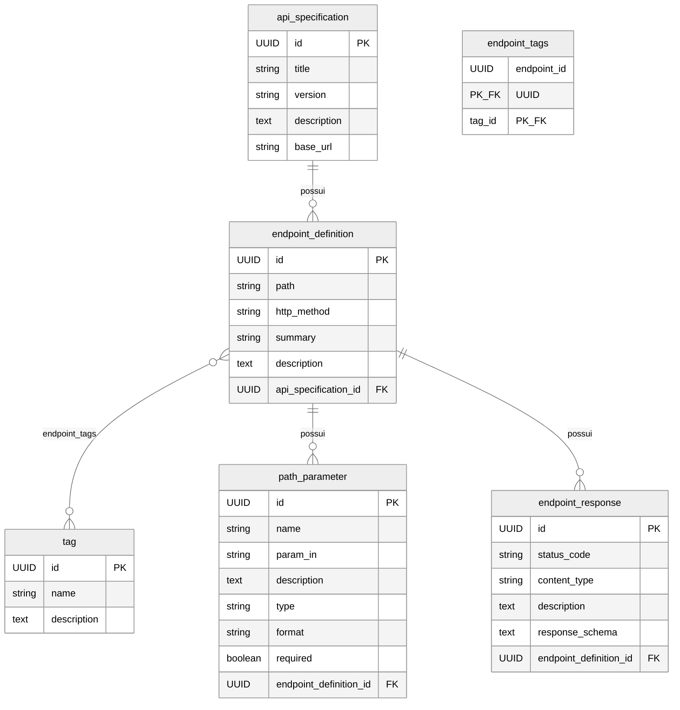

# Diagrama C4 — MockAI

O modelo C4 descreve a arquitetura em 4 níveis de detalhe progressivo:
- **Nível 1 — Contexto:** O sistema e quem interage com ele
- **Nível 2 — Container:** Os processos e armazenamentos que compõem o sistema
- **Nível 3 — Componente:** Os módulos internos de cada container
- **Nível 4 — Código:** As classes e entidades principais

---

## Nível 1 — Contexto do Sistema

> Quem usa o MockAI e como ele se encaixa no mundo externo.

---

## Nível 2 — Containers

> Os processos e armazenamentos que compõem o MockAI.

---

## Nível 3 — Componentes

> Os módulos internos da MockAI Application, seguindo Clean Architecture.

---

## Nível 4 — Código (Modelo de Dados)

> As entidades JPA que representam o modelo de dados persistido no H2.

---

## Resumo das Tecnologias por Camada

| Camada | Tecnologia | Responsabilidade |
|---|---|---|
| API | Spring Web MVC + SpringDoc OpenAPI 3.0.2 | Endpoints REST, validação, documentação Swagger |
| Application | Java 17 puro | Casos de uso, regras de negócio |
| Domain | Java 17 puro | Modelos e contratos (ports) |
| Infrastructure | Spring Data JPA + H2 + HTTP Client | Persistência, gateway de IA, mappers |
