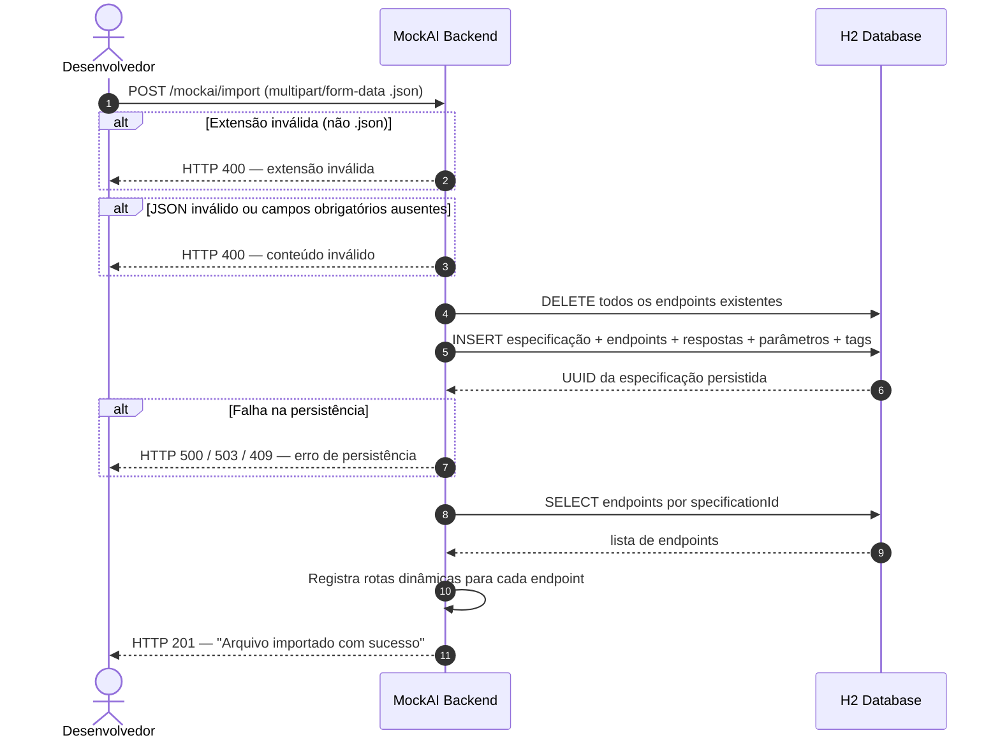
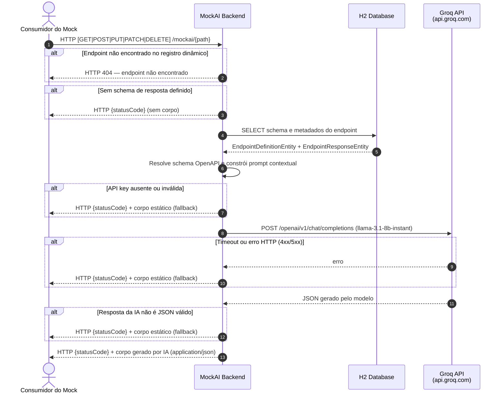
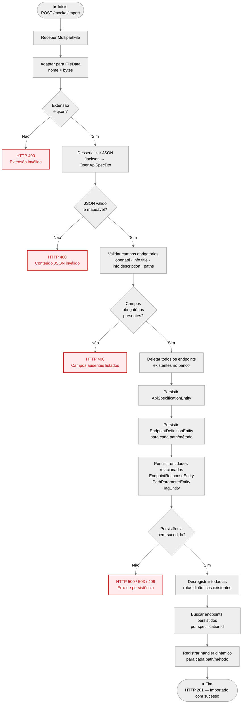
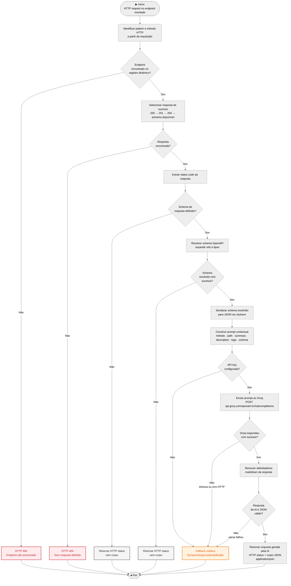

# Diagramas UML — MockAI

Este documento apresenta os diagramas UML do projeto MockAI, cobrindo os dois fluxos principais:
- **Importação de especificação Swagger/OpenAPI**
- **Obtenção de resposta por IA (endpoint mockado)**

---

## 1. Diagrama de Sequência

### 1.1 Importação de Especificação Swagger

> Sequência de interações desde o recebimento do arquivo até o registro das rotas dinâmicas.

---

### 1.2 Obtenção de Resposta por IA (Endpoint Mockado)

> Sequência de interações quando um consumidor chama um endpoint mockado dinamicamente.

---

## 2. Diagrama de Atividades

### 2.1 Processo de Importação de Especificação Swagger

> Fluxo de execução completo, incluindo decisões, desvios e caminhos alternativos.

---

### 2.2 Processo de Obtenção de Resposta por IA

> Fluxo de execução ao receber uma requisição em um endpoint mockado, incluindo fallback estático.

> **Nota sobre fallback:** Quando a IA falha (API key ausente, timeout, erro HTTP ou JSON inválido), o sistema aplica fallback estático via `DynamicResponseBodyBuilder`, que constrói um corpo de resposta baseado diretamente no schema OpenAPI sem chamar o Groq.
